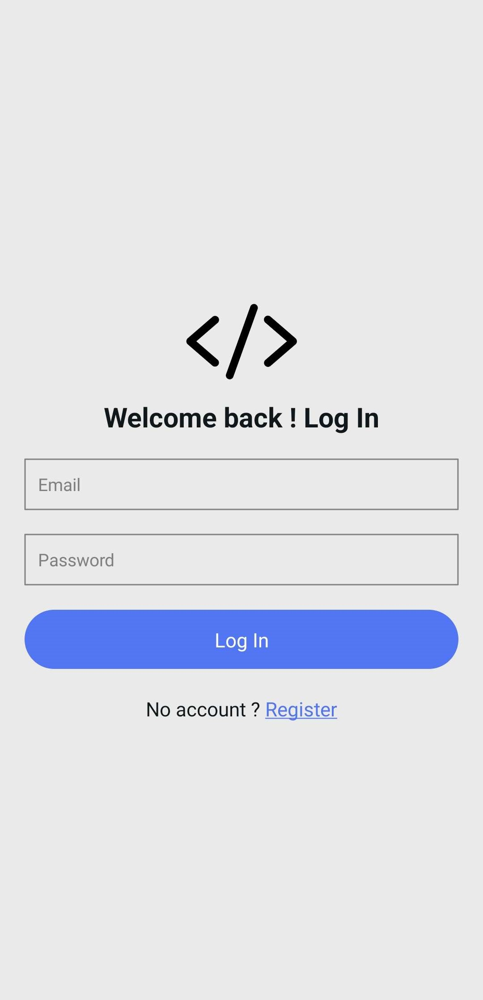
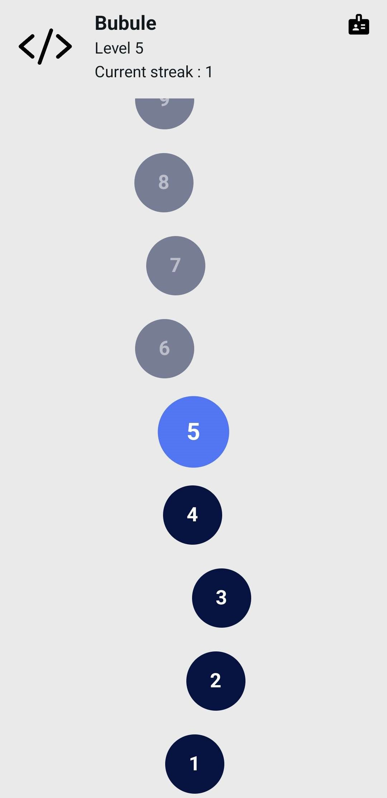
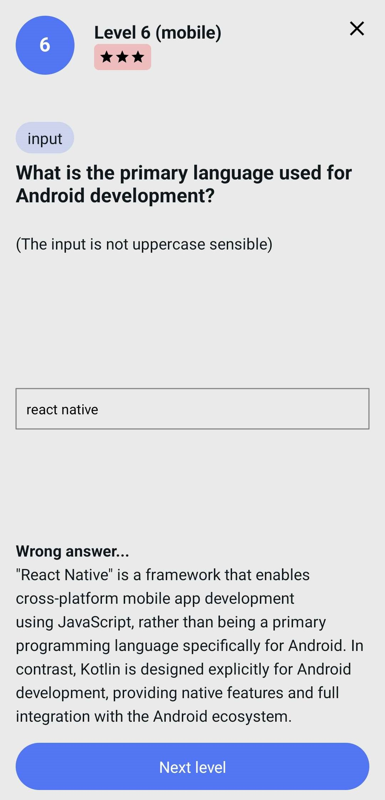
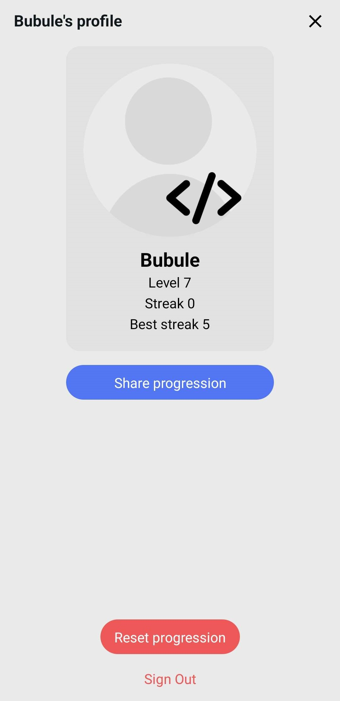

  

# DevJourney

Welcome to DevJourney! This application allows users to test their knowledge in various tech domains through quizzes.

## Introduction

DevJourney is designed to help users assess their knowledge across different areas such as web development, mobile development, security, and more. It uses MongoDB to store questions and answers and Mongoose to model the data.

## Features

- Variety of Questions: Questions covering multiple categories and difficulty levels.
- Question Types: Supports multiple-choice, true/false, text input, and code questions.
- MongoDB Database: Uses MongoDB for flexible and scalable data storage.
- Mongoose Schema: Well-defined Mongoose schema for data validation and structure.

## User interface

  
  

  
  

